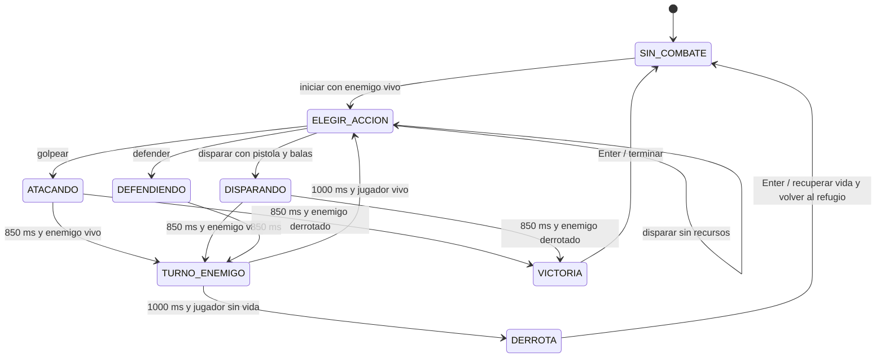

# Combate por turnos y diario de misiones

## Separación entre reglas y presentación

`combate.py` decide estados, probabilidades, daño y gasto de munición.
`batalla.py` dibuja personajes, barras de vida, mensajes, animaciones y menú.
`main.py` entrega las acciones y actualiza el reloj del combate en cada fotograma.
`arte.py` contiene los dibujos originales, sin archivos de imágenes externos.

La animación de una barra representa la vida real, pero no la modifica.
Las pausas de las fases usan el reloj de Pygame; no bloquean el bucle ni el cierre
de la ventana. Las entradas repetidas se ignoran fuera de `ELEGIR_ACCION`.

## Autómata de combate

Estados almacenados en `Combate.estado`:

```text
SIN_COMBATE, ELEGIR_ACCION, ATACANDO, DISPARANDO,
DEFENDIENDO, TURNO_ENEMIGO, VICTORIA, DERROTA
```



Los resultados `CRITICO`, `GOLPE_NORMAL`, `IMPACTO`, `FALLO`, `ESQUIVE` y
`BLOQUEO` son resultados probabilísticos de una fase, registrados en la
transición; no son estados persistentes adicionales de `Combate.estado`.

| Acción | Resultado | Probabilidad | Daño |
| --- | --- | --- | --- |
| Golpear | Crítico | 20% | 20 |
| Golpear | Normal | 65% | 10 |
| Golpear | Fallo | 15% | 0 |
| Disparar | Crítico | 30% | 30 |
| Disparar | Impacto | 60% | 20 |
| Disparar | Fallo | 10% | 0 |
| Respuesta enemiga | Esquive del jugador | 30% | 0 |
| Respuesta enemiga | Impacto | 70% | Daño del enemigo |
| Respuesta tras defender | Esquive | 30% | 0 |
| Respuesta tras defender | Bloqueo parcial | 70% | Mitad entera del daño enemigo |

Una bala se consume cuando se ejecuta un disparo válido, incluso si falla.
Un enemigo derrotado no contraataca. Tras la derrota, se reinicia al enemigo
actual, se recupera la vida, se vacía la pila y se vuelve al refugio. Se conserva
el progreso de las demás misiones, igual que en la versión anterior.

## Diario y progreso

`DiarioMisiones.actualizar()` consulta el estado del mundo; no inventa un segundo
estado de misión ni cambia las condiciones del punto de evacuación.

| Misión | Pasos que muestra | Condición de finalización |
| --- | --- | --- |
| Medicinas perdidas | Hablar, recoger medicina, regresar con Elena | `mision.completada` |
| Despejar la comisaría | Derrotar al policía | `not zombi_comisaria.vivo` |
| Amenaza en el sótano | Derrotar al corredor | `not zombi_sotano.vivo` |

El porcentaje cuenta los cinco pasos; el contador lateral cuenta las tres
misiones. Por eso completar la misión de Elena produce 60% y 1/3 misiones.
Recoger primero la medicina completa ese paso, pero no equivale a entregarla.
El aviso de misión completada dura cuatro segundos; la misión terminada sigue
visible en el diario. Al alcanzar 3/3, la guía indica ir a la evacuación.

J abre/cierra el diario y Esc lo cierra. Consultarlo pausa el movimiento y las
interacciones del mundo; no está disponible durante una batalla. El panel G y
el diario son excluyentes. El progreso no se guarda en disco al cerrar el juego.

## Comprobaciones reproducibles

`python Codigo/pruebas_juego.py` ejecuta 12 pruebas con el reloj y el azar
controlados: fases, límites de probabilidades, munición, bloqueo de acciones
repetidas, defensa, victoria sin contraataque, derrota, barras y diario.
La prueba de requisitos compara el diario con las ocho combinaciones de flags
de evacuación. Las pruebas narrativas siguen en `pruebas_alcanzabilidad.py`.
