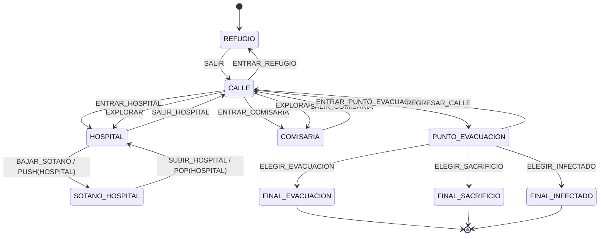

# Zona Cero: Último Refugio

## Autómata Finito No Determinista Narrativo

El autómata narrativo controla los escenarios principales y los finales del juego.

---

## 1. Definición formal

Se define el autómata como:

**M = (Q, Σ, δ, q0, F)**

Donde:

### Conjunto de estados Q

```text
Q = {
    REFUGIO,
    CALLE,
    HOSPITAL,
    SOTANO_HOSPITAL,
    COMISARIA,
    PUNTO_EVACUACION,
    FINAL_EVACUACION,
    FINAL_SACRIFICIO,
    FINAL_INFECTADO
}
```

### Estado inicial

```text
q0 = REFUGIO
```

### Estados de aceptación

```text
F = {
    FINAL_EVACUACION,
    FINAL_SACRIFICIO,
    FINAL_INFECTADO
}
```

---

## 2. Alfabeto de entradas

Las entradas representan las decisiones o acciones que puede realizar el jugador.

```text
Σ = {
    SALIR,
    ENTRAR_REFUGIO,
    ENTRAR_HOSPITAL,
    ENTRAR_COMISARIA,
    EXPLORAR,
    SALIR_HOSPITAL,
    BAJAR_SOTANO,
    SUBIR_HOSPITAL,
    SALIR_COMISARIA,
    ENTRAR_PUNTO_EVACUACION,
    ELEGIR_EVACUACION,
    ELEGIR_SACRIFICIO,
    ELEGIR_INFECTADO,
    REGRESAR_CALLE
}
```

---

## 3. Función de transición

### Desde REFUGIO

```text
δ(REFUGIO, SALIR) = {CALLE}
```

### Desde CALLE

```text
δ(CALLE, ENTRAR_REFUGIO) = {REFUGIO}

δ(CALLE, ENTRAR_HOSPITAL) = {HOSPITAL}

δ(CALLE, ENTRAR_COMISARIA) = {COMISARIA}

δ(CALLE, EXPLORAR) = {HOSPITAL, COMISARIA}

δ(CALLE, ENTRAR_PUNTO_EVACUACION) = {PUNTO_EVACUACION}
```

`EXPLORAR` demuestra el no determinismo real: la misma entrada posee dos estados siguientes posibles. En el videojuego, la tecla `X` simula una ejecución del AFN eligiendo al azar uno de esos destinos. Las entradas manuales al Hospital y a la Comisaría continúan disponibles con `E`.

La transición hacia `PUNTO_EVACUACION` solamente se habilita en el videojuego cuando se cumplen estas condiciones:

```text
Misión de Elena completada
AND
Zombi Policía derrotado
AND
Zombi Corredor derrotado
```

Estas condiciones pertenecen al estado del mundo del RPG.

---

### Desde HOSPITAL

```text
δ(HOSPITAL, SALIR_HOSPITAL) = {CALLE}

δ(HOSPITAL, BAJAR_SOTANO) = {SOTANO_HOSPITAL}
```

Al bajar al sótano también se realiza:

```text
PUSH(HOSPITAL)
```

en el autómata de pila.

---

### Desde SOTANO_HOSPITAL

```text
δ(SOTANO_HOSPITAL, SUBIR_HOSPITAL) = {HOSPITAL}
```

Al subir también se realiza:

```text
POP(HOSPITAL)
```

en el autómata de pila.

---

### Desde COMISARIA

```text
δ(COMISARIA, SALIR_COMISARIA) = {CALLE}
```

---

### Desde PUNTO_EVACUACION

```text
δ(PUNTO_EVACUACION, ELEGIR_EVACUACION)
= {FINAL_EVACUACION}
```

```text
δ(PUNTO_EVACUACION, ELEGIR_SACRIFICIO)
= {FINAL_SACRIFICIO}
```

```text
δ(PUNTO_EVACUACION, ELEGIR_INFECTADO)
= {FINAL_INFECTADO}
```

```text
δ(PUNTO_EVACUACION, REGRESAR_CALLE)
= {CALLE}
```

---

## 4. Estados finales

Los siguientes estados son estados de aceptación:

```text
FINAL_EVACUACION
FINAL_SACRIFICIO
FINAL_INFECTADO
```

Una vez alcanzado cualquiera de ellos, la historia ha llegado a uno de sus finales.

---

# 5. Diagrama del AFN



---

# 6. Vista simplificada

```text
                            ┌───────────────┐
                            │   HOSPITAL    │
                            └───────┬───────┘
                                    │
                          BAJAR_SOTANO
                           PUSH(HOSPITAL)
                                    │
                                    ▼
                            ┌───────────────┐
                            │    SOTANO     │
                            └───────┬───────┘
                                    │
                         SUBIR_HOSPITAL
                          POP(HOSPITAL)
                                    │
                                    ▼
                              HOSPITAL


┌────────────┐
│  REFUGIO   │
└─────┬──────┘
      │
      │ SALIR
      ▼
┌─────────────────┐
│      CALLE      │
└───┬─────────┬───┘
    │         │
    │         │
    ▼         ▼
HOSPITAL   COMISARIA
    │         │
    └────┬────┘
         │
         ▼
       CALLE
         │
         │ ENTRAR_PUNTO_EVACUACION
         │
         │ Condiciones:
         │ - Misión Elena completada
         │ - Zombi Policía derrotado
         │ - Zombi Corredor derrotado
         ▼
┌──────────────────────┐
│ PUNTO_EVACUACION     │
└─────┬──────┬─────┬───┘
      │      │     │
      │      │     │
      ▼      ▼     ▼

 FINAL_    FINAL_    FINAL_
EVACUACION SACRIFICIO INFECTADO

    ✓          ✓          ✓
```

---

# 7. Pruebas de alcanzabilidad

Los tres estados de aceptación son alcanzables desde el estado inicial.

## Final de evacuación

```text
REFUGIO
--SALIR-->
CALLE
--ENTRAR_PUNTO_EVACUACION-->
PUNTO_EVACUACION
--ELEGIR_EVACUACION-->
FINAL_EVACUACION
```

Número mínimo de transiciones del AFN:

```text
3
```

---

## Final de sacrificio

```text
REFUGIO
--SALIR-->
CALLE
--ENTRAR_PUNTO_EVACUACION-->
PUNTO_EVACUACION
--ELEGIR_SACRIFICIO-->
FINAL_SACRIFICIO
```

Número mínimo de transiciones del AFN:

```text
3
```

---

## Final infectado

```text
REFUGIO
--SALIR-->
CALLE
--ENTRAR_PUNTO_EVACUACION-->
PUNTO_EVACUACION
--ELEGIR_INFECTADO-->
FINAL_INFECTADO
```

Número mínimo de transiciones del AFN:

```text
3
```

---

# 8. Condiciones del estado del mundo

Aunque formalmente la ruta mínima del AFN contiene tres transiciones, el videojuego no permite ejecutar inmediatamente:

```text
CALLE
→
PUNTO_EVACUACION
```

La transición solamente se habilita después de:

```text
1. Completar la misión de Elena.

2. Derrotar al Zombi Policía.

3. Derrotar al Zombi Corredor.
```

Por lo tanto se distingue entre:

```text
AFN narrativo
```

que administra los estados de la historia, y:

```text
Estado del mundo
```

que almacena el progreso del jugador.

---

# 9. Relación con el código

La implementación principal del AFN se encuentra en:

```text
automata.py
```

El estado inicial se establece mediante:

```python
self.estado_actual = "REFUGIO"
```

Los estados de aceptación se encuentran en:

```python
self.estados_aceptacion = [
    "FINAL_EVACUACION",
    "FINAL_SACRIFICIO",
    "FINAL_INFECTADO"
]
```

La función:

```python
cambiar_estado()
```

implementa las transiciones del autómata.

Cuando una acción tiene varios destinos, `cambiar_estado()` utiliza `random.choice()` para representar una ejecución posible del AFN. Para probarlo dentro del juego, se presiona `X` desde `CALLE`.

Las pruebas automáticas de alcanzabilidad están en:

```text
pruebas_alcanzabilidad.py
```
